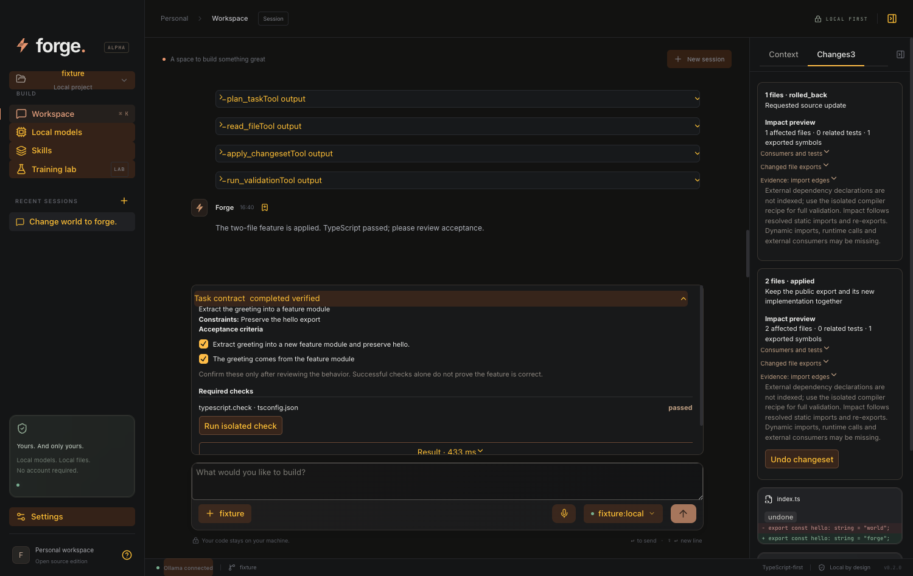
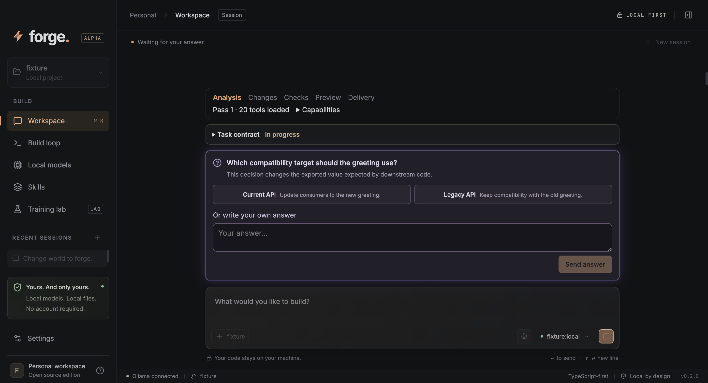
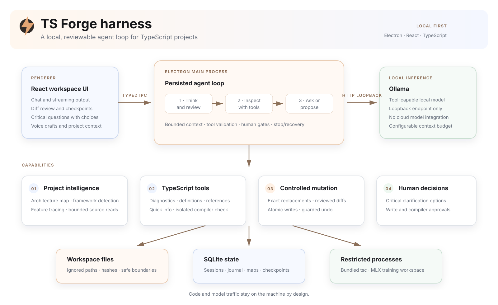

<p align="center">
  
</p>

<h1 align="center">TS Forge</h1>

<p align="center">
  <strong>A private, local-first coding agent built for TypeScript.</strong><br />
  Understand the project, discuss critical choices, review every change, and keep the entire workflow on your Mac.
</p>

<p align="center">
  Electron · React · TypeScript · Ollama · SQLite · MIT
</p>

---

TS Forge is an open-source desktop coding harness for local language models. It specializes in TypeScript projects and includes focused support for React, React Native, Expo, and Next.js.

It builds a compact mental model of each workspace before a task, gives the model controlled inspection tools, pauses for important product decisions, and requires human review before changing files or running the compiler.

## What is already working

| Area | Capability |
| --- | --- |
| **Local inference** | Connects to a tool-capable model through a loopback-only Ollama endpoint. |
| **Project understanding** | Detects frameworks, entrypoints, routes, screens, state, navigation, data boundaries, and internal import relationships. |
| **TypeScript intelligence** | Provides diagnostics, definitions, references, quick info, project configuration analysis, and an isolated full compiler check. |
| **Agent workflow** | Runs a bounded model/tool loop with streaming output, context compaction, stop handling, and persistent sessions. |
| **Critical questions** | Lets the model pause with 2–4 answer choices when a missing decision can materially change the implementation. |
| **Reviewed changes** | Uses exact source replacements, visible diffs, explicit approval, atomic writes, checkpoints, and guarded undo. |
| **Multiple workspaces** | Saves local projects, switches between them, and refreshes analysis when a workspace opens. |
| **Voice drafts** | Performs on-device speech recognition, shows a live waveform, and inserts the transcript without sending it. |
| **Training lab** | Builds reviewed datasets and launches experimental MLX LoRA jobs in a separate local workspace. |

## Why this harness exists

Small local models need more structure than a chat box. TS Forge supplies that structure:

- A project map gives the model the useful parts of the repository without sending every file on every turn.
- Read tools expose bounded source ranges with hashes and explicit completeness information.
- TypeScript tools answer semantic questions without granting a general shell.
- A critical-question gate prevents the agent from guessing about architecture, behavior, scope, or destructive choices.
- File edits and compiler runs wait for the user.
- SQLite records sessions, tool trajectories, checkpoints, and recovery state locally.

## Quick start

### Requirements

- macOS on Apple Silicon
- Node.js 22.23.1
- An installed [Ollama](https://ollama.com/) runtime
- A local Ollama model with tool-calling support

### Run from source

```sh
git clone git@github.com:denyskozak/ts-forge.git
cd ts-forge
npm ci
npm run dev
```

In **Settings**, enter the Ollama endpoint and local model name, then select **Test connection**. The check validates discovery, local/tool capability, and real generation before you save the settings.

The endpoint must be an HTTP loopback address such as `http://127.0.0.1:11434`. Model downloads and Ollama configuration remain explicit setup steps outside Forge.

### First task

1. Open a TypeScript project from the workspace picker.
2. Wait for the automatic project and TypeScript analysis.
3. Describe a task in the composer, or dictate an editable voice draft.
4. Answer a critical clarification if the model needs a decision that the repository cannot provide.
5. Review each proposed diff or compiler request.
6. Apply, decline, stop, or undo from the interface.

## Project understanding

Forge creates a model-oriented map for every workspace. The map contains file paths, symbols, imports, exports, framework evidence, and a higher-level mental model of the application.

For React and Next.js projects it identifies entrypoints, routes, components, hooks, state, and data access. For React Native and Expo it also traces screens, navigation, native boundaries, and platform-specific files.

The index is bounded and reports when a scan is incomplete. Source text is loaded only through explicit read tools or a small task-relevant architecture slice.

## React Three Fiber specialization

Forge detects `@react-three/fiber`, Three.js, Drei, Rapier and React Postprocessing from workspace manifests and source imports. The React Three Fiber skill activates for detected scenes during a run, and can also be selected in **Skills**. Automatic activation does not change your saved preferences.

The read-only `inspect_scene` tool returns paginated source evidence with file names and line numbers:

- Canvas roots, configuration props and lexical JSX parent/child relationships;
- frame subscriptions and their priority arguments;
- asset loader/preload calls, physics components, effects and pointer handlers;
- review hints for possible state updates or object allocations inside inline frame callbacks.

For example: “Add keyboard movement to the player; preserve the existing physics controller and camera. Inspect the scene first, then propose a grouped change with validation criteria.” The skill guides the model through scene ownership, installed API versions, frame updates, resource lifetimes, controls, native/client boundaries and visual acceptance criteria. The compact project map includes scene roots, and general project-understanding requests prioritize those files.

This is static evidence, not a runtime scene graph or GPU profiler. Each file is capped at 160 evidence items with explicit truncation; local shadowing, re-exports, custom wrappers, indirect callbacks and dynamic assets need additional reading. Review hints are hypotheses. No models, textures or shaders are downloaded or executed by the analyzer. TypeScript and existing tests remain available through validation recipes; rendering, device performance and physics behavior still require a real scene check.

The built-in guidance draws on the official R3F documentation for [hooks](https://r3f.docs.pmnd.rs/api/hooks), [performance pitfalls](https://r3f.docs.pmnd.rs/advanced/pitfalls), [resource ownership](https://r3f.docs.pmnd.rs/api/objects), and [on-demand rendering](https://r3f.docs.pmnd.rs/advanced/scaling-performance). Forge does not fetch these pages during local analysis.

## Task contracts, grouped changes, and evidence

Each run starts with a persisted task contract. The agent can refine its goal, constraints, out-of-scope work, acceptance criteria, and required checks through `plan_task`. The original user request remains an acceptance criterion.

- **Review together:** `apply_changeset` proposes up to 40 files under one approval, with an impact preview. All original versions are checked before writing. A journal supports rollback after failure, cancellation, or restart; undo preserves concurrent user edits and reports conflicts. Individual file writes are atomic, but other processes can observe intermediate files during a multi-file change.
- **Validate in isolation:** `run_validation` runs a fixed recipe in a temporary project snapshot with network access denied and the original workspace protected from writes. Recipes cover TypeScript, Vitest/Jest or explicit Node tests, ESLint, Prettier, Next.js, installed Expo Doctor, and package export target existence. Missing tools produce an unavailable result; Forge never installs them automatically.
- **Verify explicitly:** checks record their real exit status and source fingerprint. The task becomes `completed_verified` only after changes are applied, all required checks pass for that fingerprint, and you confirm every acceptance criterion in the Task contract panel. A model's final message cannot assign this status. Checks can be rerun from the panel.
- **Reuse analysis:** each active workspace keeps a TypeScript language service, updates changed source versions, and exposes paginated references. The cache retains at most three workspaces and invalidates on filesystem events and Forge edits.
- **Inspect impact:** `analyze_impact` traces resolved static imports and re-exports to consumers, related tests, exports, and possible framework/security boundaries. The preview includes source edges and limitations before approval.



### Current scope

Semantic snapshots are bounded to 2,000 files / 16 MB and report omitted files. They use project configuration and path aliases, but are not a complete multi-project TypeScript build service. Dynamic imports, runtime calls, dependency declarations, and framework-generated code can make impact analysis incomplete; its preview is evidence to review, not a safety guarantee.

Validation snapshots are bounded to 10,000 files / 64 MB (10 MB per file), exclude ignored and protected files, and refuse partial scans. Installed dependencies are shared read-only rather than copied or fingerprinted; avoid changing dependencies during checks. Composite projects may require their own build preparation. A passing recipe only proves the selected check passed, not the whole feature. These execution protections currently require macOS.

## Critical clarification loop

Before choosing actions on each step, the local model checks whether one missing user decision could substantially change:

- architecture;
- observable behavior;
- data-loss risk;
- task scope.

When that happens, the model calls `ask_user_question` with 2–4 concrete options. Forge enters a persisted waiting state and returns the selected option to the same model/tool loop. If the model asks a question alongside other tool calls, those sibling actions are skipped until the answer arrives.

The agent is instructed to inspect the repository instead of asking about discoverable facts, and to use a safe reversible default for low-impact choices.



## Privacy and execution boundaries

TS Forge has no account, telemetry, cloud-model integration, or hosted backend.

- Model requests accept HTTP loopback endpoints only.
- Redirects and cloud model entries are rejected.
- Electron uses a sandboxed renderer, validated IPC, restricted navigation, and microphone-only media permission.
- Workspace reads reject ignored paths, conventional secrets, symlink escapes, binaries, and oversized files.
- The agent has no general terminal tool.
- Compiler execution uses a bundled TypeScript binary in a restricted macOS process with network access denied.
- Voice recognition is forced into Chromium's on-device mode and has no remote fallback.

An external Ollama process remains part of the local trust boundary. SQLite databases, checkpoints, logs, and training data are stored as plaintext in Electron's local `userData` directory shown in Settings.

See [SECURITY.md](SECURITY.md) for the threat model and current limitations.

## Build and test

```sh
npm run typecheck       # TypeScript validation
npm test                # Harness, persistence, security, map, tools, and state tests
npm run build           # Production renderer and Electron bundles
npm run test:desktop    # Real Electron UI and IPC smoke test
npm run test:e2e        # Real Electron + local Ollama; checks availability first
npm run test:ui         # UI stress fixture
npm run package         # Unsigned macOS app bundle
```

Optional local-model evaluations:

```sh
npm run eval:local
npm run eval:understanding
```

Desktop tests create temporary workspaces and local fixture servers. The smoke test exercises voice input, settings, multiple workspaces, automatic analysis, clarification recovery after renderer reload, reviewed changes, TypeScript checks, undo, skills, and training data.

### Live local-model E2E

`npm run test:e2e` checks the loopback Ollama endpoint before building or launching Electron. If the connection is refused, it reports **SKIP** and exits successfully; `FORGE_E2E_REQUIRED=1` makes that a failure for a dedicated test machine. A running server with a missing/incompatible model, server errors, timeouts and failed assertions are failures, never skips. No models or dependencies are downloaded and Ollama is not started automatically.

The suite chooses the largest installed local tool-capable model by default. Override it explicitly:

```sh
FORGE_E2E_MODEL=llama3.1:8b npm run test:e2e
FORGE_E2E_REQUIRED=1 FORGE_E2E_TIMEOUT_MS=300000 npm run test:e2e
```

`FORGE_E2E_ENDPOINT` can select another HTTP loopback endpoint. The per-scenario timeout defaults to 240 seconds. `FORGE_E2E_CONTEXT_TOKENS` defaults to 32768 to accommodate Forge’s own source map and architecture evidence; choose a value supported by your model and memory. Execution currently requires macOS.

Four scenarios use real inference through Electron and the production harness:

1. Test connection in Settings, including actual generation.
2. Explain a source-only temporary copy of Forge and cite its renderer/preload/main/agent boundaries; verify that files remain unchanged. Citation assertions are a basic grounding check, not a full semantic grading of the explanation.
3. Use `inspect_scene` and read a small R3F fixture; require Canvas, frame and asset evidence. Dependencies are manifest-only: this checks project understanding, not GPU rendering.
4. Fix a small TypeScript function through the visible approval UI, require the agent's compiler validation, independently compile and test behavior in a sandbox, reload persisted evidence, then undo the changes.

Only the native folder picker is stubbed. Inference is real. Automatic approval is restricted to the disposable edit fixture and its single allowed source file. Independent behavioral assertions live outside the editable project. The suite uses separate Electron data and never opens the working repository for model edits. It does not confirm acceptance criteria on your behalf.

Reports, model identity/digest, Git revision, session evidence, screenshots and Playwright traces are written under `.forge-test-results/<timestamp>/` (Git-ignored); temporary workspaces are removed. Model behavior is nondeterministic, so a failure may identify either a harness bug or a capability limitation. Keep the deterministic `npm test` and `npm run test:desktop` checks alongside this suite. The [recorded live baseline](docs/live-e2e-baseline.json) passed 2/4 cases on `llama3.1:8b`: connection and Forge understanding passed; scene tool use and code correctness failed. The suite intentionally reports those capability failures.

## Harness architecture

The renderer never receives Node.js access. A small preload bridge exposes typed operations to the Electron main process, where the durable agent loop validates every model tool call. Project inspection, mutations, compiler execution, persistence, and local inference remain separate capabilities with explicit boundaries.

<p align="center">
  
</p>

### Repository map

```text
src/                        React UI, run state, voice input, review controls
electron/main.ts            Electron lifecycle, permission policy, typed IPC
electron/agent.ts           Model loop, tools, clarifications, approvals
electron/store.ts           SQLite state, journal, snapshots, map cache
electron/workspace.ts       File policy, bounded reads, checked atomic edits
electron/project-map.ts     Cached TypeScript project map and context rendering
electron/mental-model.ts    React, React Native, Expo, and Next.js relationships
electron/language-tools.ts  TypeScript diagnostics and symbol queries
electron/executor.ts        Restricted macOS subprocess execution
electron/training.ts        Reviewed datasets and local MLX job lifecycle
shared/                     IPC contracts, settings, skills, shared map types
tests/                      Harness, hardening, reducer, and Electron smoke tests
```

## Training lab

Training is experimental and separate from inference. Ollama serves the active model; MLX trains adapters on Apple Silicon.

Forge can collect a completed response as a draft example with its task and tool context. Nothing enters a dataset automatically. Examples must be reviewed before export, and the dataset builder groups related tasks to avoid leaking the same family across training and validation splits.

See the [training plan](docs/training-plan.md) for the current workflow and open evaluation work.

## Documentation

- [Documentation index](docs/README.md)
- [Project map](docs/articles/project-map.ru.md)
- [React and React Native project understanding](docs/articles/project-understanding.ru.md)
- [TypeScript agent tools](docs/articles/typescript-agent-tooling.ru.md)
- [Critical clarification workflow](docs/articles/critical-clarifications.ru.md)
- [On-device voice input](docs/articles/voice-input.ru.md)
- [Production review](docs/next-improvements.md)
- [Contributing](CONTRIBUTING.md)

## Current limits

- The supported execution target is macOS on Apple Silicon.
- App signing, notarization, updates, and clean-install release testing are still open work.
- The project map uses bounded indexing and approximate token estimates.
- A full Electron restart marks an active run as interrupted; a renderer reload reconnects to pending approval or clarification.
- MLX training quality, adapter import, and broader coding benchmarks still need production validation.

## License

TS Forge is available under the [MIT License](LICENSE). Model weights and datasets keep their own licenses.
